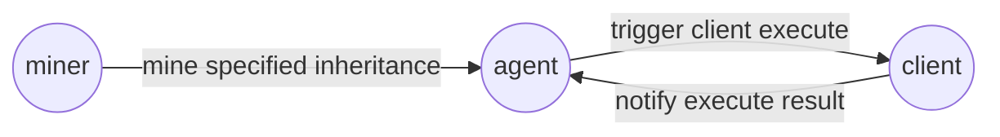

# The on-chain (EOSIO chain) assets inheritance contracts

Inheritance contracts (agent side and client side) are used to pre-allocate on-chain assets to specified accounts(inheritors). 
Those inheitors will actually receive the assets when the inheritance conditions met and the transfer actions triggered(or mined) by
third parties(the miners).

## Table of Contents

- [Background](#background)
- [Structures](#structures)
- [Build and Run](#build-and-run)
- [Run demo (debug)](#run-demo-debug)

## Background

On-chain assets are protected by asymmetric encryption in which private keys play the key role. In reality, owning a private key means
owning the assets linked to it. As a result, how to store the private keys securely is becoming the essential techniques in cryptocurrency
world. Many methods have been introduced like: encrypted hardware wallet, cold(offline) wallet or even key-printed-paper wallet. Those ways
of protection undoubtedly impove the security level by isolating the private key data from online environment. However, from another point
of view, assets can become lost-prone when private keys are controlled by a single person which unfuturnately is quite common. When they
are controlled by only one person, there is no way to tolerate the private keys being lost no matter by missing the wallet device, accidently
damaging the storage media or even the memory killing of the human owner. Take the mysterious death of the owner of exchange QuadrigaCX,
for instance. Up to $190 million owned to 115,000 customers were lost or could not be accessed because only the owner held the password to
off-line cold wallets.

In stead of managing assets with private keys owned by single person, on-chains inheritance contracts can be used to sprend the private-key-lost
risk by diversifying into different specified persons(accounts). The inheritance contracts will conditionally transfer the assets from the
private-key-lost owner to the specified inheritors. It should be noted that those assets are still fully controlled by the original owner
before the conditions met. To achieve this, the original account owner needs turn his/her account from normal account to contract
account by deploying the inheritance client contract.

## Structures

The inheritance contracts mechanism consists of 3 roles as the following:

- **client**

    The asset owner who hold the private key. This owner can deploy client contract to activate the inheritance function to specify how much assets
    are allocated to which accounts at what datetime.

- **agent**

    The inheritance action inherface. It severs 2 purposes: 1. provents miners from interracting with client contract directly; 2. records the service
    charge to clients and the reward earned by miners.

- **miner**

    Some one who triggers the client-state-change actions which will finally transfer the assets to the inheritors. Miners earn reward by calling the
    mining action at the very right datetime.

**The following graph illustrates the relationship between the three**



### 

**The whole process of inheritance** as the following involving two contracts: ***client contract*** and ***agent contract***

1. Agent deployment
   - Agent downloads and deploys the **agent contract**.
   - Agent initializes the contract.
### 
2. Client deployment
   - Client downloads and deploys the **client contract**.
   - Client initializes the contract.
   - Client enables the inheritance: enable action is a global switch to enable or disable all the inheritance allocations.
   - Client allocates assets: specifies inheritor account, assets quantity, datetime, cool down duration(heistate period).
     Client provides a action can be used to suspend the specified inheritance individually rather than globally.
### 
3. Client deposits tokens to agent for the inheritance service. Client can withdraw the deposit before inheritance conditions being met.
### 
4. Miner deposits tokens to agent for the promise: charge will be made if the miner uncarefully calls the mining actions frequently.
### 
5. Miner mines inheritance sepcified by the client: if the mining changes the inheritance state successfully, miner will receive reward.
   - CD(cool down) mining: change inheritance state from active to heistate.
   - transfer mining: change inheritance state from heistate to transfered(assets will be transfered to inhertors accordingly).
### 

## Build and Run

- [Build contracts](#build-contracts)
- [Deploy contracts](#deploy-contracts)
- [Client assets allocation](#client-assets-allocation)
- [Agent actions](#agent-actions)
- [Miner and Client deposit](#miner-and-client-deposit)

#### Build contracts
```bash
cd inheritance/InheritAgent
mkdir build && cd build
cmake ..
make

cd inheritance/InheritClt
mkdir build && cd build
cmake ..
make
```

#### Deploy contracts
Assume the client account named: **client**, the agent account named: **agent**, the client contract named: **InheritClt**, the agent contract
named: **InheritAgent**
```bash
cleos set contract agent InheritAgent -p agent
cleos push action agent init '[""]' -p agent
cleos set account permission agent active --add-code

cleos set contract client InheritClt -p client
cleos push action client init '[""]' -p client
cleos set account permission client active --add-code
cleos push action client setenable '[true]' -p client
```

#### Client assets allocation
- **to allocate assets**

    Client allocates assets **ASSET AMOUNT** of token contract **CONTRACT NAME** to account inheritor account **INHERITOR** at datetime **DATETIME** plus
    heistate duration **CD** and remark **REMARK**

```bash
  cleos push action client allocate '["INHERITOR", "CONTRACT NAME", "ASSET AMOUNT", DATETIME, CD, "REMARK"]' -p client
```
- **to update or reactivate inheritance allocation**

    Recall above action with the same **INHERITOR** and **CONTRACT NAME** will update and activate the previous inheritance allocation

- **to cancel the allocation**

    Call following action with account **INHERITOR**, token contract **CONTRACT NAME** and the **TOKEN SYMBOL**
```bash
  cleos push action client unallocate '["INHERITOR", "CONTRACT NAME", "TOKEN SYMBOL"]' -p client
```

- **to freeze the allocated inheritance**

    Call following action with account **INHERITOR**, token contract **CONTRACT NAME** and the **TOKEN SYMBOL**
```bash
  cleos push action client freeze '["INHERITOR", "CONTRACT NAME", "TOKEN SYMBOL"]' -p client
```

#### Agent actions

- **to mine**

    Miner can mine client's inheritance by specifying the inheritor account **INHERITOR**, token contract **CONTRACT NAME**, asset amount **ASSET AMOUNT**, client account **CLIENT** and the miner himself/herself **MINER**. If the miner mines the inheritance successfully, he/she will get the mining reward.
    If the miner mines 3 times and all failed, he/she will get a fine (used to provent miners from mining frequently and waste resource).

```bash
  cleos push action agent mine '["INHERITOR", "CONTRACT NAME", "ASSET AMOUNT", "CLIENT", "MINER"]' -p MINER
```

- **miner claims reward**

    Miner can call this action to claim the reward plus the desposit
```bash
  cleos push action agent minerclaim '["MINER"]' -p MINER
```

- **client claims deposit**

    Client can claim the previous deposit made for the service. However, if any successful mining happened before calling this action, the service charge amount will be non-refundable.
```bash
  cleos push action agent clientclaim '["CLIENT"]' -p CLIENT
```

- **agent claims reward**

    Agent can claim the reward for the inheritance service
```bash
  cleos push action agent selfclaim '["RECEIVER ACCOUNT"]' -p agent
```

#### Miner and Client deposit

- **miner deposit**

    Miner deposits token to agent by transfer with remark "miner"
```bash
   cleos transfer MINER agent "TOKEN AMOUNT" "miner" -p MINER
```
- **client deposit**

    Client deposits token to agent by transfer with remark "client"
```bash
   cleos transfer CLIENT agent "TOKEN AMOUNT" "client" -p CLIENT
```


## Run demo (debug)
#### agent deployment
```bash
cleos set contract agent InheritAgent -p agent
```
>>>
Reading WASM from /projects/contracts/inheritance/InheritAgent/build/InheritAgent/InheritAgent.wasm...<br/>
Publishing contract...<br/>
executed transaction: 997eb8357fa15fa3baacc3115040610069b9e378821d521eeda0b1fbb70689c3  14408 bytes  2774 us<br/>
\#         eosio <= eosio::setcode               {"account":"agent","vmtype":0,"vmversion":0,"code":"0061736d0100000001ed012460000060017e0060047e7e7e...<br/>
\#         eosio <= eosio::setabi                {"account":"agent","abi":"0e656f73696f3a3a6162692f312e31010553746174650575696e74380d0a436c69656e7442...<br/>
warning: transaction executed locally, but may not be confirmed by the network yet         ]
>>>

```bash
cleos push action agent init '[""]' -p agent
```
>>>
executed transaction: 578a5a68412902bbab924fea3c03f5c6182d0ed5827993d0db1062e1592f90ff  96 bytes  273 us<br/>
\#         agent <= agent::init                  ""<br/>
warning: transaction executed locally, but may not be confirmed by the network yet         ] 
>>>

```bash
cleos set account permission agent active --add-code
```
>>>
executed transaction: f3290972c9125ffe7d1a68ab9790cb9f14d9f4bc3ee77a9f5617f041313187eb  184 bytes  196 us<br/>
\#         eosio <= eosio::updateauth            {"account":"agent","permission":"active","parent":"owner","auth":{"threshold":1,"keys":[{"key":"EOS8...
>>>

#### client deployment
```bash
cleos set contract client InheritClt -p client
```
>>>
Reading WASM from /projects/contracts/inheritance/InheritClt/build/InheritClt/InheritClt.wasm...<br/>
Publishing contract...<br/>
executed transaction: 3908bad5450f01bf7563cbdbd1bfdcb8f6fec9545e90caf2676480d1c04b2df8  15544 bytes  8610 us<br/>
\#         eosio <= eosio::setcode               {"account":"client","vmtype":0,"vmversion":0,"code":"0061736d0100000001fd012660000060017e0060047e7e7...<br/>
\#         eosio <= eosio::setabi                {"account":"client","abi":"0e656f73696f3a3a6162692f312e31010553746174650575696e74380e0a416c6c6f63617...<br/>
warning: transaction executed locally, but may not be confirmed by the network yet         ] 
>>>

```bash
cleos push action client init '[""]' -p client
```
>>>
executed transaction: 9a9aad2bd97f3a4604bd2a1ac763c38b3d6e871e9cfa0842f10613227a3ec8d0  96 bytes  230 us<br/>
\#        client <= client::init                 ""<br/>
warning: transaction executed locally, but may not be confirmed by the network yet         ] 
>>>

```bash
cleos set account permission client active --add-code
```
>>>
executed transaction: 1c8c2c6f94514a028477f340eb17e1102425ea0f3f63429ecb45b04494f1f193  184 bytes  181 us<br/>
\#         eosio <= eosio::updateauth            {"account":"client","permission":"active","parent":"owner","auth":{"threshold":1,"keys":[{"key":"EOS...<br/>
warning: transaction executed locally, but may not be confirmed by the network yet  
>>>

```bash
cleos push action client setenable '[true]' -p client
```
>>>
executed transaction: 10c7dc22b2f333e604106cd0628418b5cffb2415d5707308aad03bd7387dc683  96 bytes  245 us<br/>
\#        client <= client::setenable            {"enabled":1}<br/>
\>> [InheritClt::setenable] enabled<br/>
warning: transaction executed locally, but may not be confirmed by the network yet         ] 
>>>

#### client assets allocation
```bash
cleos push action client allocate '["inheritor1", "eosio.token", "10.0000 SYS", 1578392977, 60, "inheritance test: allocate 10 SYS to inheritor1"]' -p client
```
>>>
executed transaction: ebbd77941e567fd551474ca2ae1f55bfd688f5192de5c5f3e96f3039d876a4e9  184 bytes  456 us<br/>
\#        client <= client::allocate             {"inheritor":"inheritor1","tokencontract":"eosio.token","quantity":"10.0000 SYS","validFrom":1578392...<br/>
\>> [InheritClt::allocate] allocated : 10.0000 SYS, unallocated: 90.0000 SYS, transfered: 0.0000 SYS<br/>
warning: transaction executed locally, but may not be confirmed by the network yet         ] 
>>>

```bash
cleos push action client allocate '["inheritor2", "eosio.token", "20.0000 SYS", 1578392977, 30, "inheritance test: allocate 20 SYS to inheritor2"]' -p client
```
>>>
executed transaction: 7e3dae04c01a1e704988cdb38f6feffae8036e78fbf190800884c3d8a41b8f6b  184 bytes  497 us<br/>
\#        client <= client::allocate             {"inheritor":"inheritor2","tokencontract":"eosio.token","quantity":"20.0000 SYS","validFrom":1578392...<br/>
\>> [InheritClt::allocate] allocated : 30.0000 SYS, unallocated: 70.0000 SYS, transfered: 0.0000 SYS<br/>
warning: transaction executed locally, but may not be confirmed by the network yet  
>>>

#### miner and client deposit
A miner can deposit into (transfer to) agent with comment "miner". A client can deposit with comment "client". Any transfer to agent token with remark other than "miner" or "client" will be refunded immediately.
```bash
cleos transfer miner1 agent "0.1000 SYS" "miner" -p miner1
```
>>>
executed transaction: a39da0f87006f701d7236e64e87875d444f994fd676d17ef661992e6db6f66e4  136 bytes  477 us<br/>
\#   eosio.token <= eosio.token::transfer        {"from":"miner1","to":"agent","quantity":"0.1000 SYS","memo":"miner"}<br/>
\#        miner1 <= eosio.token::transfer        {"from":"miner1","to":"agent","quantity":"0.1000 SYS","memo":"miner"}<br/>
\#         agent <= eosio.token::transfer        {"from":"miner1","to":"agent","quantity":"0.1000 SYS","memo":"miner"}<br/>
\>> [InheritAgent::ondeposit] receive miner deposit from miner1, quantity: 0.1000 SYS, memo: miner<br/>
warning: transaction executed locally, but may not be confirmed by the network yet         ] 
>>>
```bash
cleos transfer client agent "5.0000 SYS" "client" -p client
```
>>>
executed transaction: ff9c942565397da80957e584a7e6c04120506e7befa7eba486a39f87dd32f6d8  136 bytes  489 us<br/>
\#   eosio.token <= eosio.token::transfer        {"from":"client","to":"agent","quantity":"5.0000 SYS","memo":"miner"}<br/>
\#        client <= eosio.token::transfer        {"from":"client","to":"agent","quantity":"5.0000 SYS","memo":"miner"}<br/>
\#         agent <= eosio.token::transfer        {"from":"client","to":"agent","quantity":"5.0000 SYS","memo":"miner"}<br/>
\>> [InheritAgent::ondeposit] receive miner deposit from client, quantity: 5.0000 SYS, memo: miner<br/>
warning: transaction executed locally, but may not be confirmed by the network yet         ] 
>>>


#### mining
```bash
cleos push action agent mine '["inheritor1", "eosio.token", "10.0000 SYS", "client", "miner1"]' -p miner1
```
If the CD mining condition is met, the following result will be printed out
>>>
executed transaction: e1b0f3b5b4217eb306f7cdd80d4589273c0435c86279d2afb0647bd05b6edb69  144 bytes  8266 us<br/>
\#         agent <= agent::mine                  {"inheritor":"inheritor1","tokencontract":"eosio.token","quantity":"10.0000 SYS","assetclient":"clie...<br/>
\>> [InheritAgent::mine] call onagentmine action   first receiver: agent; inheritor: inheritor1, token contract: eosio.token, quantity: 10.0000 SYS<br/>
\#        client <= client::onagentmine          {"inheritor":"inheritor1","tokencontract":"eosio.token","quantity":"10.0000 SYS","assetclient":"clie...<br/>
\>> [InheritClt::onagentmine] done CD mining, inheritor: inheritor1, token contract: eosio.token, quantity: 10.0000 SYS, cdBeganTime: 1578542493<br/>
\#         agent <= client::onagentmine          {"inheritor":"inheritor1","tokencontract":"eosio.token","quantity":"10.0000 SYS","assetclient":"clie...<br/>
warning: transaction executed locally, but may not be confirmed by the network yet         ] 
>>>

If the miner mines repeatedly like calling above "mine" action again will receive following result
>>>
executed transaction: fe264b70252fad0194e20cd86f1a1a24a57be05456de4c98feb006e27cf5c5e2  144 bytes  534 us<br/>
\#         agent <= agent::mine                  {"inheritor":"inheritor1","tokencontract":"eosio.token","quantity":"10.0000 SYS","assetclient":"clie...<br/>
\>> [InheritAgent::mine] call onagentmine action   first receiver: agent; inheritor: inheritor1, token contract: eosio.token, quantity: 10.0000 SYS<br/>
\#        client <= client::onagentmine          {"inheritor":"inheritor1","tokencontract":"eosio.token","quantity":"10.0000 SYS","assetclient":"clie...<br/>
\>> [InheritClt::onagentmine] repeated CD mining invalid<br/>
warning: transaction executed locally, but may not be confirmed by the network yet         ] 
>>>

if the transfer mining condition is met (only possible after CD mining done), calling above actioin will get the following that shows the client's specified inheritance assets are transfered to the inheritor accordingly
>>>
executed transaction: 9a591c3b9c8ba1a9e4dc6ee08f684e7da42d989def28fa14212da12d3fb01d76  144 bytes  1316 us<br/>
\#         agent <= agent::mine                  {"inheritor":"inheritor1","tokencontract":"eosio.token","quantity":"10.0000 SYS","assetclient":"clie...<br/>
\>> [InheritAgent::mine] call onagentmine action   first receiver: agent; inheritor: inheritor1, token contract: eosio.token, quantity: 10.0000 SYS<br/>
\#        client <= client::onagentmine          {"inheritor":"inheritor1","tokencontract":"eosio.token","quantity":"10.0000 SYS","assetclient":"clie...<br/>
\>> [InheritClt::onagentmine] done Transfer mining, inheritor: inheritor1, token contract: eosio.token, quantity: 10.0000 SYS, transTime: 1578543215<br/>
\#         agent <= client::onagentmine          {"inheritor":"inheritor1","tokencontract":"eosio.token","quantity":"10.0000 SYS","assetclient":"clie...<br/>
\#   eosio.token <= eosio.token::transfer        {"from":"client","to":"inheritor1","quantity":"10.0000 SYS","memo":"inheritance test: allocate 10 SY...<br/>
\#        client <= eosio.token::transfer        {"from":"client","to":"inheritor1","quantity":"10.0000 SYS","memo":"inheritance test: allocate 10 SY...<br/>
\#    inheritor1 <= eosio.token::transfer        {"from":"client","to":"inheritor1","quantity":"10.0000 SYS","memo":"inheritance test: allocate 10 SY...<br/>
warning: transaction executed locally, but may not be confirmed by the network yet         ] 
>>>

- Note: for every inheritance allocation record being served, the client need to pay the service respectivelly. The client can deposit enough tokens for all the allocations to process or do that separately as long as the mining conditions unmet and no mining occurs. Otherwise error message will be presented during the mining process which cause the inheritance service stopped.

#### claim
call the following action will claim the assets including previous deposit and mining reward
```bash
cleos push action agent minerclaim '["miner1"]' -p miner1
```
This example shows miner1 has been rewarded 2.0000 SYS (for the previous CD mining and transfer mining). This miner received 2.1000 SYS in total including the 0.1000 SYS deposit
>>>
executed transaction: 714f89c5b36da72b0ec079b2deadf0c81fed2867ca2b8f7fa6b023db00449b48  104 bytes  728 us<br/>
\#         agent <= agent::minerclaim            {"miner":"miner1"}<br/>
\>> [InheritAgent::minerclaim] reward: 2.0000 SYS, deposit refund: 0.1000 SYS<br/>
\#   eosio.token <= eosio.token::transfer        {"from":"agent","to":"miner1","quantity":"2.1000 SYS","memo":"reward: 2.0000 SYS, deposit refund: 0....<br/>
\#         agent <= eosio.token::transfer        {"from":"agent","to":"miner1","quantity":"2.1000 SYS","memo":"reward: 2.0000 SYS, deposit refund: 0....<br/>
\#        miner1 <= eosio.token::transfer        {"from":"agent","to":"miner1","quantity":"2.1000 SYS","memo":"reward: 2.0000 SYS, deposit refund: 0....<br/>
warning: transaction executed locally, but may not be confirmed by the network yet         ] 
>>>

call the following action will refund any token balance of client left in agent
```bash
cleos push action agent clientclaim '["client"]' -p client
```
assume there are 2.0000 SYS tokens left in agent, call above action will receive the following printout
>>>
executed transaction: df99fef744c320a5981d3358e99309624931f7fb30468d43ba77f6c4a85ecf3f  104 bytes  593 us<br/>
\#         agent <= agent::clientclaim           {"client":"client"}<br/>
\>> [InheritAgent::clientclaim] deposit refund: 2.0000 SYS<br/>
\#   eosio.token <= eosio.token::transfer        {"from":"agent","to":"client","quantity":"2.0000 SYS","memo":"deposit refund: 2.0000 SYS"}<br/>
\#         agent <= eosio.token::transfer        {"from":"agent","to":"client","quantity":"2.0000 SYS","memo":"deposit refund: 2.0000 SYS"}<br/>
\#        client <= eosio.token::transfer        {"from":"agent","to":"client","quantity":"2.0000 SYS","memo":"deposit refund: 2.0000 SYS"}<br/>
warning: transaction executed locally, but may not be confirmed by the network yet         ] 
>>>
